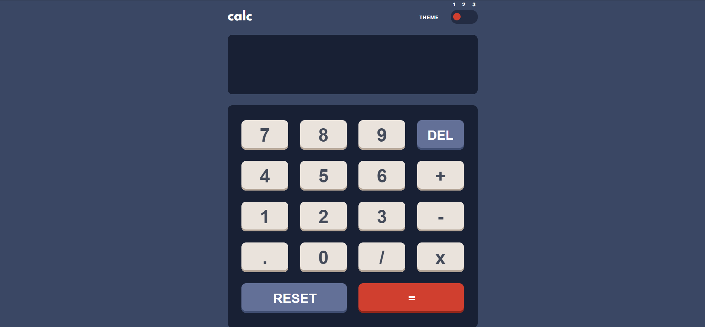
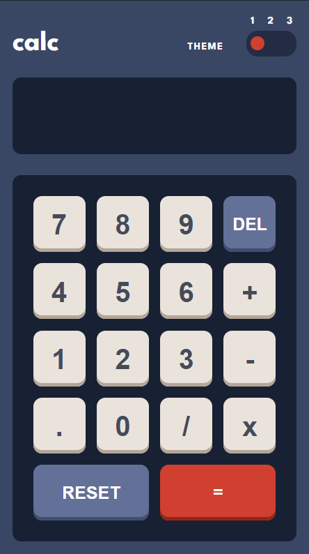

<div id="top"></div>

<div align="center">

  

  <h2 align="center">Calculator App Solution</h2>
  <p align="center">
    <a href="https://www.frontendmentor.io/challenges/calculator-app-9lteq5N29"><strong>Frontend Mentor Challenge</strong></a>
    <br />
    <br />
    <a href="https://calculator-app-rj-jefferson.vercel.app/">Live Preview</a>
  </p>
</div>

<div align="center">
  <!-- Profile -->
  <a href="https://www.frontendmentor.io/profile/jeffersonrj14">
    
  </a>
  <!-- Status -->
    <a href="#">
    
  </a>

</div>
<br />
<div align="center">

<h2>Screenshot</h2>



</div>



This is a solution to the
[Calculator app challenge on Frontend Mentor](https://www.frontendmentor.io/challenges/calculator-app-9lteq5N29).
Frontend Mentor challenges help you improve your coding skills by building realistic projects.

## Table of contents

- [Overview](#overview)
  - [The challenge](#the-challenge)
  - [Links](#links)
- [My process](#my-process)
  - [Built with](#built-with)
  - [My Objective](#my-objective)
  - [What I learned](#what-i-learned)
  - [Continued development](#continued-development)
  - [Useful resources](#useful-resources)
- [Getting Started](#getting-started)
- [Author](#author)

## Overview

### The challenge

Users should be able to:

- See the size of the elements adjust based on their device's screen size
- Perform mathematical operations like addition, subtraction, multiplication, and division
- Adjust the color theme based on their preference
- **Bonus**: Have their initial theme preference checked using `prefers-color-scheme` and have any
  additional changes saved in the browser

### Links

- Github Repo URL:
  [https://github.com/jeffersonrj14/Calculator-App](https://github.com/jeffersonrj14/Calculator-App)
- Solution URL: [Add solution URL here](https://github.com/jeffersonrj14/Calculator-App)
- Live Site URL:
  [https://calculator-app-rj-jefferson.vercel.app/](https://calculator-app-rj-jefferson.vercel.app/)

## My process

### Built with

- [Vite](https://vitejs.dev/)
- [React](https://react.dev/)
  - [React Router](https://reactrouter.com/)
  - [React Helmet Async](https://www.npmjs.com/package/react-helmet-async)
- [TypeScript](https://www.typescriptlang.org/)
- Linting & Code Formatting
  - [Eslint](https://eslint.org/)
  - [Prettier](https://prettier.io/)
- [PNPM](https://pnpm.io/)
- Hosting
  - [Vercel](https://vercel.com/)

### My Objective

I practiced this solution using TypeScript since I'm currently still learning it and want to try
using it in this projects.

### What I Learned

This side project was quite challenging for me. However, through this experience, I've gained a solid understanding of how to implement the calculator logic and handle various edge cases effectively. This project has significantly improved my problem-solving skills and my ability to apply TypeScript in practical scenarios.

### Continued Development

I will keep on improving my understanding of advanced TypeScript concepts, such as generics and
decorators. I will also focus on learning how to test React applications using libraries like Jest.

For these projects, I'm planning to add sound effects/noise. For example, when I click a button, it
will produce a click sound.

### Useful resources

- [CSS Reference](https://www.w3schools.com/cssref/index.php) - This resource helped me understand
  specific CSS properties and their usage. I found the pattern and explanations very clear and
  useful, and I will continue to use this reference in the future.
- [TypeScript CheatSheet](https://www.typescriptlang.org/cheatsheets/) - This resource helped me
  understand TypeScript better, particularly with type annotations and interface usage.

## Getting Started

| Description                       | Command        |
| --------------------------------- | -------------- |
| To install dependencies           | `pnpm install` |
| To start the development server   | `pnpm dev`     |
| To build your project             | `pnpm build`   |
| To lint your code                 | `pnpm lint`    |
| To preview your built project     | `pnpm preview` |
| To format your code with Prettier | `pnpm format`  |

### Note: If you encounter an error, please follow these steps:

1. Delete `pnpm-lock.yaml` and `node_modules`.
2. Run the following commands:

```bash
pnpm install
```

3. Then

```bash
pnpm dev
```

4. Optionally, you can also clean up your pnpm store for better performance

```bash
pnpm store prune
```

## Author

- Website - [RJ Jefferson](https://links.jeffersonrj.com)
- Frontend Mentor - [@jeffersonrj14](https://www.frontendmentor.io/profile/jeffersonrj14)
